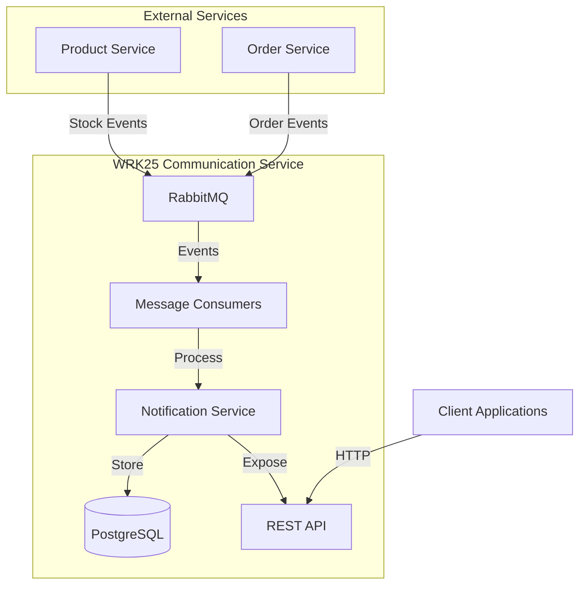
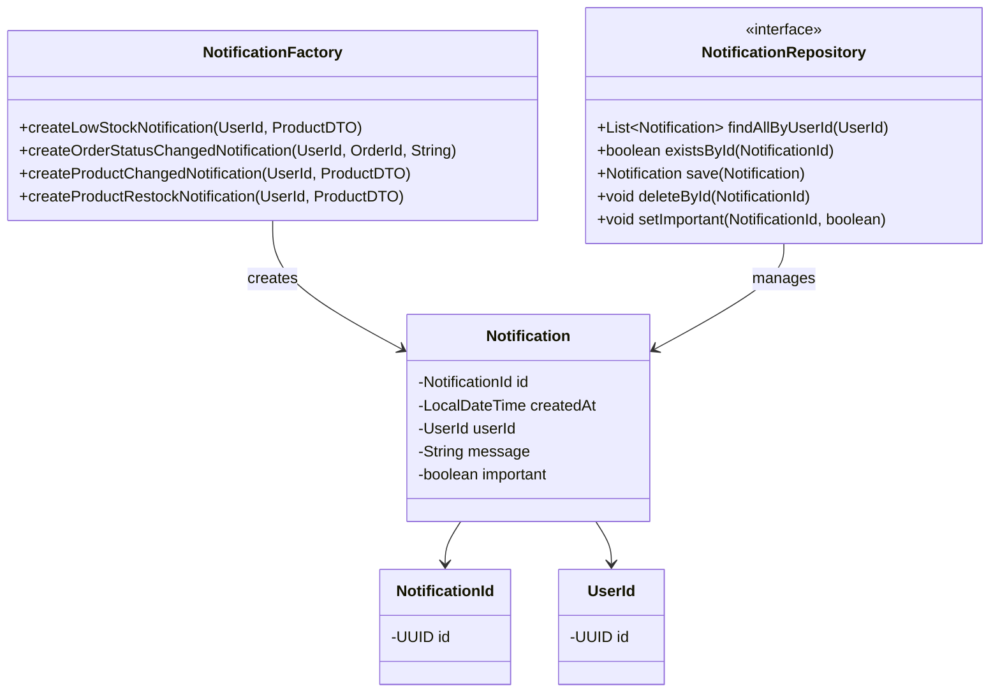
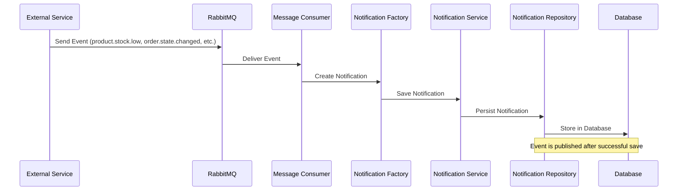

# WRK25 Communication Microservice

## Overview
The WRK25 Communication Microservice is a Spring Boot application designed to handle notifications for an e-commerce system. It processes events from other services and creates notifications for users about product stock changes, order status updates, and other important events.

## Features
- Notification management for users
- Integration with RabbitMQ for event-driven architecture
- Multiple notification types:
  - Low stock notifications
  - Product stock change notifications
  - Product restock notifications
  - Order status change notifications
- REST API for notification management
- Persistence with PostgreSQL database

## Architecture

### System Architecture


### Domain Model


### Message Flow


## Setup and Installation

### Prerequisites
- Java 17
- Maven
- Docker and Docker Compose (for containerized deployment)
- PostgreSQL
- RabbitMQ

### Environment Variables
The application requires the following environment variables:

```
# RabbitMQ Configuration
RABBITMQ_HOST=localhost
RABBITMQ_PORT=5672
RABBITMQ_USERNAME=guest
RABBITMQ_PASSWORD=guest
RABBITMQ_VHOST=/

# Database Configuration
DB_URL=jdbc:postgresql://localhost:5432/notifications
DB_USERNAME=postgres
DB_PASSWORD=postgres

# Application Configuration
PORT=8080
```

### Running Locally
1. Clone the repository
2. Set up the required environment variables
3. Run the application:
   ```
   ./mvnw spring-boot:run
   ```

### Running with Docker
1. Build the Docker image:
   ```
   docker build -t wrk25-communication .
   ```
2. Run the container:
   ```
   docker run -p 8080:8080 \
     -e RABBITMQ_HOST=rabbitmq \
     -e RABBITMQ_PORT=5672 \
     -e RABBITMQ_USERNAME=guest \
     -e RABBITMQ_PASSWORD=guest \
     -e RABBITMQ_VHOST=/ \
     -e DB_URL=jdbc:postgresql://postgres:5432/notifications \
     -e DB_USERNAME=postgres \
     -e DB_PASSWORD=postgres \
     wrk25-communication
   ```

### Cloud Deployment
The application is deployed on Google Cloud Platform using Cloud Run. The deployment is automated through GitHub Actions workflows.

#### Production Environment
The production environment is accessible at:
```
https://coms-microservice-899231617905.europe-southwest1.run.app
```

#### Deployment Process
1. Changes pushed to the main branch trigger the CI/CD pipeline
2. After successful tests, the application is built as a Docker image
3. The image is pushed to Google Artifact Registry
4. The application is deployed to Cloud Run with public access

#### RabbitMQ Service
The application uses CloudAMQP for RabbitMQ messaging in the cloud environment. The RabbitMQ management interface is accessible at:
```
https://kangaroo-01.rmq.cloudamqp.com
```

## API Documentation

### Endpoints

#### Get Notifications
```
GET https://coms-microservice-899231617905.europe-southwest1.run.app/api/notifications/{userId}
```
Returns all notifications for a specific user.

#### Delete Notification
```
DELETE https://coms-microservice-899231617905.europe-southwest1.run.app/api/notifications/{id}
```
Deletes a notification by its ID.

#### Update Notification Importance
```
PATCH https://coms-microservice-899231617905.europe-southwest1.run.app/api/notifications/{id}
```
Updates the importance status of a notification.

## Monitoring
To be implemented:

The application exposes metrics for Prometheus at the `/actuator/prometheus` endpoint. A sample Prometheus configuration is provided in the `monitoring` directory.

## Development

### Project Structure
The project follows a clean architecture pattern:

- **Domain Layer**: Core business logic and entities
- **Application Layer**: Use cases and application services
- **Infrastructure Layer**: External interfaces, repositories, and messaging

### Testing
Run the tests with:
```
./mvnw test
```

## License
[MIT License](LICENSE)
